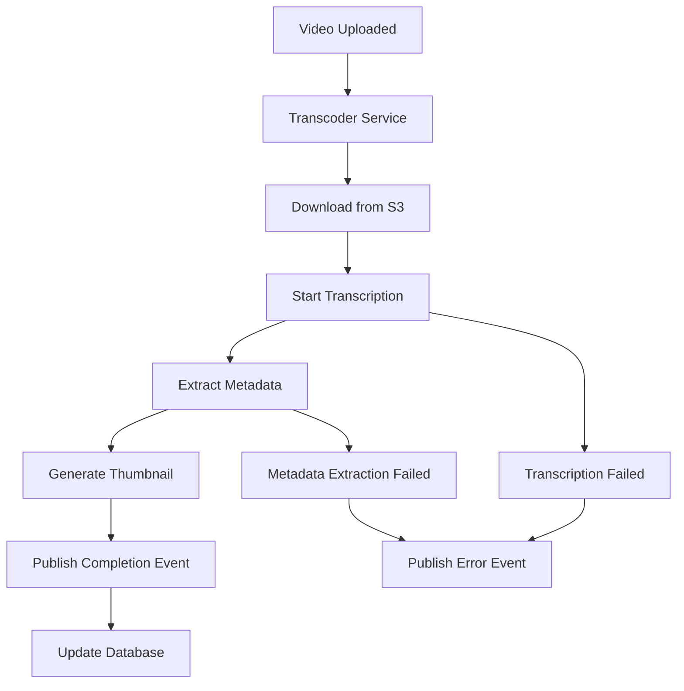

# Transcoder Service

The Transcoder Service is a Kafka-based microservice responsible for video processing, transcription, and content analysis in the YouTube clone application. It consumes video upload events and performs asynchronous video processing tasks.

## 🎯 Purpose

This microservice manages:
- Video transcription and speech-to-text conversion
- Video content analysis and metadata extraction
- Asynchronous video processing workflows
- Event-driven video processing pipeline
- Integration with AI/ML services for content analysis

## 🏗️ Architecture

- **Framework**: NestJS 10.x with Kafka microservice pattern
- **Message Queue**: Kafka for event consumption
- **Storage**: AWS S3 for video file access
- **Processing**: Asynchronous video processing
- **AI Services**: Integration with transcription services
- **Communication**: Event-driven architecture

## 📁 Project Structure

```
transcoder-service/
├── src/
│   ├── modules/
│   │   └── transcribe/           # Video transcription
│   │       ├── transcribe.controller.ts
│   │       ├── transcribe.service.ts
│   │       ├── transcribe.module.ts
│   │       └── transcribe-kafka-consumer.service.ts
│   ├── providers/
│   │   └── infra/               # Infrastructure providers
│   │       ├── s3/              # AWS S3 integration
│   │       ├── kafka/           # Kafka consumer
│   │       └── bullmq/         # Queue management
│   ├── common/
│   │   ├── decorators/         # Custom decorators
│   │   ├── filters/           # Exception filters
│   │   └── helpers/           # Utility functions
│   └── configs/               # Configuration files
├── test/                      # Test files
└── package.json
```

## 🚀 Features

### Video Processing
- Video transcription using AI services
- Speech-to-text conversion
- Video metadata extraction
- Thumbnail generation
- Video format analysis

### Event Processing
- Kafka event consumption
- Asynchronous processing
- Error handling and retry logic
- Processing status tracking
- Event publishing for downstream services

### AI Integration
- Integration with transcription APIs
- Content analysis and categorization
- Language detection
- Sentiment analysis
- Content moderation

## 📚 Event Handling

### Consumed Events

| Event Type | Description | Payload |
|------------|-------------|---------|
| `video.uploaded` | Video file uploaded | `{ videoId, userId, filePath, fileName, fileSize, mimeType, uploadedAt }` |
| `video.processing.requested` | Processing requested | `{ videoId, processingType, priority }` |

### Published Events

| Event Type | Description | Payload |
|------------|-------------|---------|
| `video.transcription.completed` | Transcription finished | `{ videoId, transcript, language, confidence }` |
| `video.processing.completed` | Processing finished | `{ videoId, status, metadata, processedAt }` |
| `video.processing.failed` | Processing failed | `{ videoId, error, failedAt }` |

## 🔧 Configuration

### Environment Variables

Create a `.env` file in the transcoder-service directory:

```env
# Kafka Configuration
KAFKA_BROKER=localhost:9092
KAFKA_CLIENT_ID=transcoder-service
KAFKA_GROUP_ID=transcoder-consumer-group
KAFKA_TOPIC_VIDEO_UPLOADED=video.uploaded
KAFKA_TOPIC_PROCESSING_REQUESTED=video.processing.requested

# AWS S3 Configuration
AWS_ACCESS_KEY_ID=your-aws-access-key
AWS_SECRET_ACCESS_KEY=your-aws-secret-key
AWS_REGION=us-east-1
AWS_S3_BUCKET=youtube-clone-videos

# Transcription Service Configuration
TRANSCRIPTION_SERVICE_URL=https://api.transcription-service.com
TRANSCRIPTION_API_KEY=your-transcription-api-key
TRANSCRIPTION_LANGUAGE=en-US

# Processing Configuration
MAX_CONCURRENT_PROCESSING=5
PROCESSING_TIMEOUT=300000
RETRY_ATTEMPTS=3
RETRY_DELAY=5000

# Queue Configuration
QUEUE_NAME=video-processing
QUEUE_CONCURRENCY=3
QUEUE_RETRY_ATTEMPTS=3

# Monitoring Configuration
HEALTH_CHECK_INTERVAL=30000
METRICS_ENABLED=true
```

## 🚀 Getting Started

### Prerequisites

- Node.js (v18 or higher)
- Kafka
- AWS S3 access
- Transcription service API access

### Installation

1. **Install dependencies**
   ```bash
   npm install
   ```

2. **Set up environment variables**
   ```bash
   cp .env.example .env
   # Edit .env with your configuration
   ```

3. **Start the service**
   ```bash
   # Development
   npm run start:dev

   # Production
   npm run build
   npm run start:prod
   ```

## 🔄 Processing Workflow

### Video Upload Processing

```typescript
// Event consumption example
@EventPattern('video.uploaded')
async handleVideoUploaded(@Payload() data: VideoUploadedEvent) {
  try {
    // 1. Download video from S3
    const videoBuffer = await this.s3Service.downloadFile(data.filePath);

    // 2. Start transcription process
    const transcriptionResult = await this.transcribeVideo(videoBuffer);

    // 3. Extract metadata
    const metadata = await this.extractVideoMetadata(videoBuffer);

    // 4. Publish completion event
    await this.publishTranscriptionCompleted({
      videoId: data.videoId,
      transcript: transcriptionResult.text,
      language: transcriptionResult.language,
      confidence: transcriptionResult.confidence
    });

  } catch (error) {
    // Handle processing errors
    await this.publishProcessingFailed({
      videoId: data.videoId,
      error: error.message
    });
  }
}
```

### Transcription Service Integration

```typescript
// Transcription service integration
async transcribeVideo(videoBuffer: Buffer): Promise<TranscriptionResult> {
  const formData = new FormData();
  formData.append('file', videoBuffer, 'video.mp4');
  formData.append('language', this.configService.get('TRANSCRIPTION_LANGUAGE'));

  const response = await fetch(this.configService.get('TRANSCRIPTION_SERVICE_URL'), {
    method: 'POST',
    headers: {
      'Authorization': `Bearer ${this.configService.get('TRANSCRIPTION_API_KEY')}`
    },
    body: formData
  });

  return response.json();
}
```

## 🧪 Testing

### Running Tests

```bash
# Unit tests
npm test

# E2E tests
npm run test:e2e

# Test coverage
npm run test:cov

# Watch mode
npm run test:watch
```

### Test Structure

```
test/
├── transcribe/
│   ├── transcribe.service.spec.ts
│   └── transcribe-kafka-consumer.spec.ts
├── providers/
│   ├── s3.service.spec.ts
│   └── kafka.service.spec.ts
└── app.e2e-spec.ts
```

## 📊 Data Models

### Transcription Result

```typescript
interface TranscriptionResult {
  videoId: string;
  transcript: string;
  language: string;
  confidence: number;
  duration: number;
  segments: TranscriptSegment[];
  processedAt: Date;
}

interface TranscriptSegment {
  startTime: number;
  endTime: number;
  text: string;
  confidence: number;
}
```

### Video Metadata

```typescript
interface VideoMetadata {
  videoId: string;
  duration: number;
  resolution: string;
  frameRate: number;
  bitrate: number;
  codec: string;
  fileSize: number;
  thumbnailUrl?: string;
  extractedAt: Date;
}
```

## 🔒 Security Features

### Data Protection
- Secure file access with signed URLs
- Encrypted data transmission
- Access logging and audit trails
- Data retention policies

### Error Handling
- Graceful error handling
- Retry mechanisms with exponential backoff
- Dead letter queue for failed messages
- Error notification system

## 📈 Monitoring and Health Checks

### Health Check Components

- **Kafka connectivity**
- **AWS S3 connectivity**
- **Transcription service connectivity**
- **Queue processing status**
- **Memory usage**
- **Processing queue length**

### Metrics

- Processing success/failure rates
- Average processing time
- Queue depth and throughput
- Error rates by type
- Resource utilization

## 🔄 Event Flow

### Complete Processing Flow



## 🛠️ Development

### Code Quality

```bash
# Linting
npm run lint

# Formatting
npm run format

# Type checking
npm run build
```

### Local Development

```bash
# Start with local environment
npm run start:local

# Debug mode
npm run start:debug
```

## 🚧 Future Enhancements

- **Advanced AI Features**: Content categorization, sentiment analysis
- **Multi-language Support**: Automatic language detection
- **Real-time Processing**: Live video transcription
- **Content Moderation**: Automated content filtering
- **Analytics**: Processing metrics and insights
- **Batch Processing**: Bulk video processing
- **GPU Acceleration**: Hardware-accelerated processing

## 📝 API Documentation

Since this is a Kafka microservice, it doesn't expose HTTP endpoints. However, you can monitor:

- **Health Check**: Internal health monitoring
- **Kafka Topics**: Event consumption and publishing
- **Processing Status**: Queue and processing metrics

## 🔗 Integration Examples

### Event Publishing

```typescript
// Publishing transcription completion
await this.kafkaService.publish('video.transcription.completed', {
  videoId: 'video-123',
  transcript: 'Hello, this is a test video...',
  language: 'en-US',
  confidence: 0.95,
  processedAt: new Date().toISOString()
});
```

### Error Handling

```typescript
// Publishing processing failure
await this.kafkaService.publish('video.processing.failed', {
  videoId: 'video-123',
  error: 'Transcription service unavailable',
  failedAt: new Date().toISOString(),
  retryCount: 3
});
```

## 🤝 Contributing

1. Follow the existing code structure
2. Add tests for new features
3. Update documentation
4. Ensure all tests pass
5. Follow the coding standards

## 📄 License

This service is part of the YouTube Clone project and follows the same licensing terms.